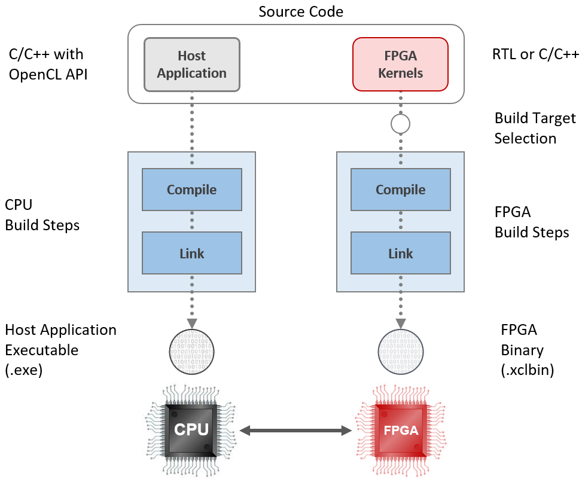

# Presentations

## Overview of the Vitis flow

1. Vitis is the development environment used to create host applications and hardware accelerators. It includes host CPU and FPGA compilers as well as profiling and debugging tools
2. In Vitis, the host application can be written in C or C++ and uses the OpenCL API or the [XRT](https://github.com/Xilinx/XRT) (Xilinx Runtime Library) to interact with the accelerated hardware functions running on the FPGA. The accelerated hardware functions (also referred to as 'hardware kernels', or just 'kernels') can be written in C, C++, OpenCL or RTL

## Video Presentations

1. Xilinx Platforms Introduction

1. Intro to Vitis for Acceleration Platforms

1. Vitis Tool Flow

1. Open CL Execution Model

1. Vitis Design Analysis

1. Vitis Design Methodology

1. Host Code Optimization

1. Kernel Optimization

1. Vitis Accelerated Libraries

1. [Introduction to PYNQ](https://www.youtube.com/watch?v=ylVEo0d83iM)